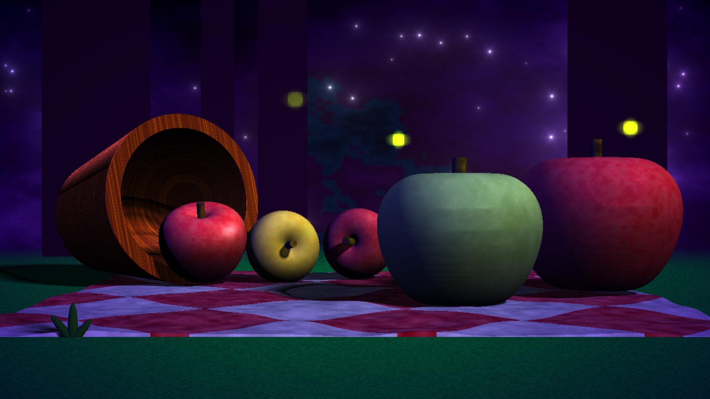
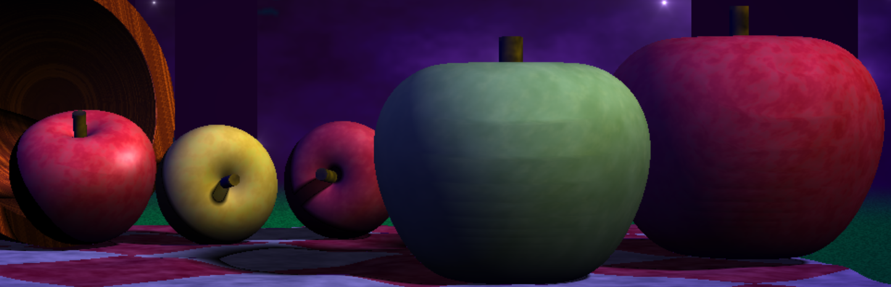
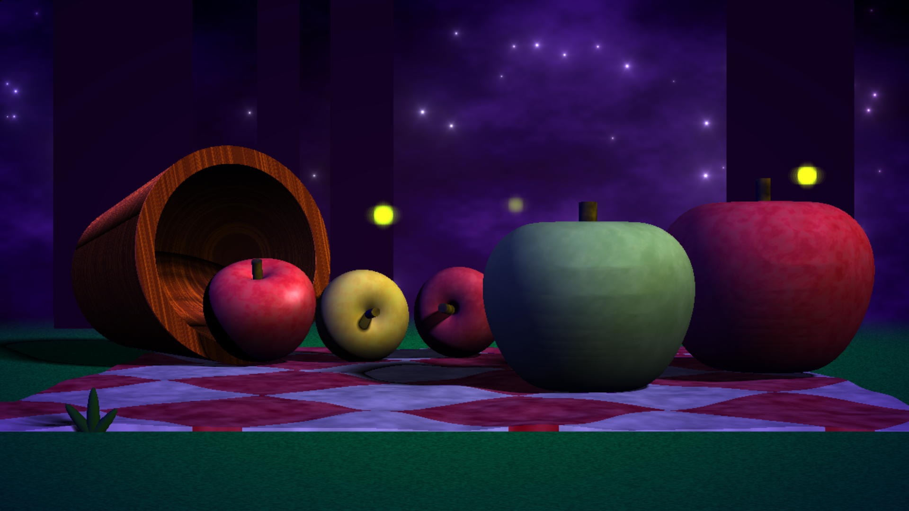
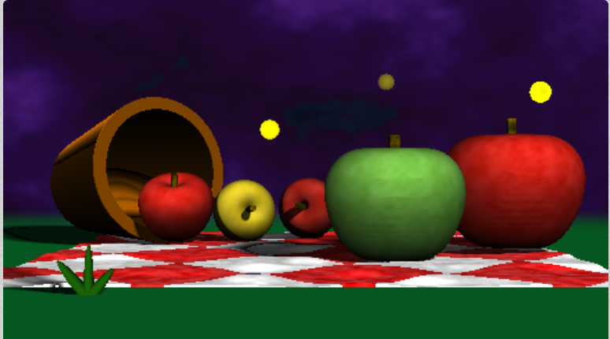
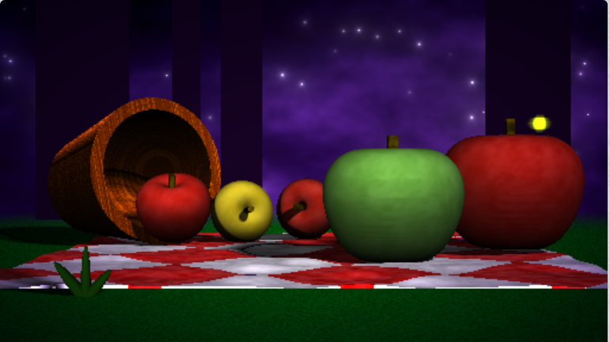
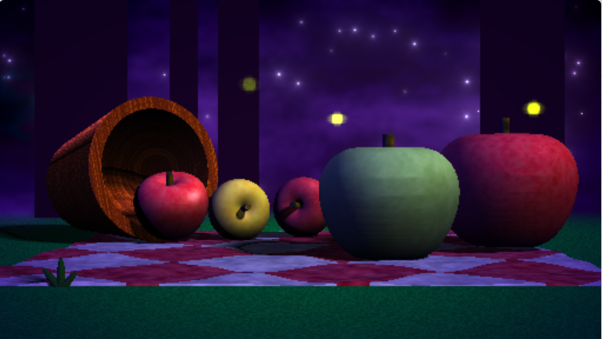
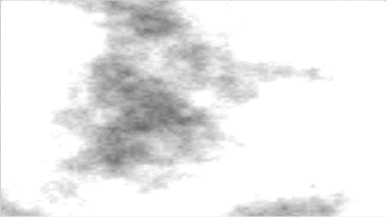
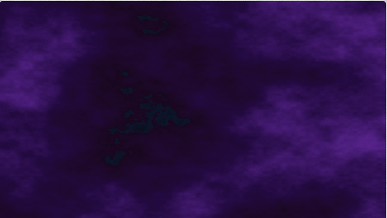
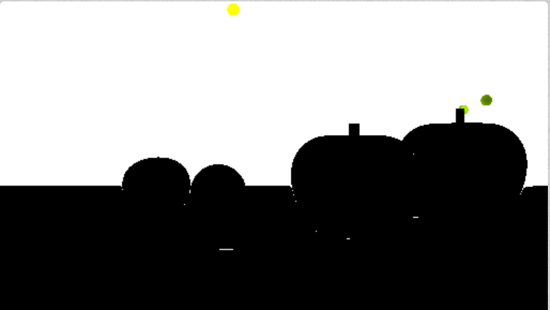
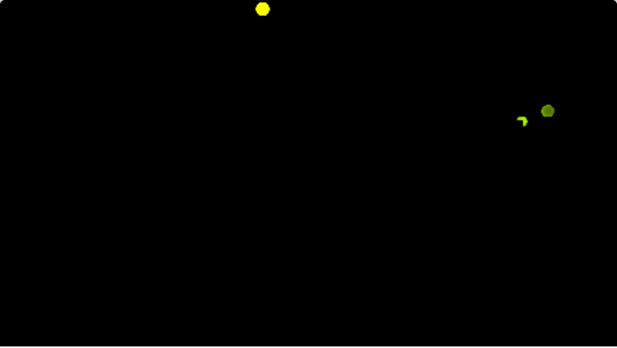

# CIS 566 Homework 3: Environment Setpiece

## Erin Goldberg
pennKey: engold

ShaderToy link: https://www.shadertoy.com/view/WsBGWc

Takes about 9 seconds to compile. Looks best in small window.

## References
- Normal Calculation http://jamie-wong.com/2016/07/15/ray-marching-signed-distance-functions/#surface-normals-and-lighting
- SDF Logic from https://www.shadertoy.com/view/llt3R4
- IQ's blog http://www.iquilezles.org/www/articles/distfunctions/distfunctions.htm
- FBM and noise functions from https://thebookofshaders.com/13/
- Lecture Slides on Noise https://docs.google.com/presentation/d/e/2PACX-1vQAK1Xeb7GGqLoDFz_iu9JuXMb-qE9jqKbZDkrXNSybXweqeIn3xvv4LMxetcM9GEugoU0Q0Ft1qUH-/pub?start=false&loop=false&delayms=60000&slide=id.g4cae677c4f_0_852
- Lecture Slides on Implicit Surfaces https://docs.google.com/presentation/d/e/2PACX-1vQYxMlaG9BEf8FiLLu0nOKGuIku2G2FyGAZcKO1tNJy4RriVxR6eDPTTGw9nRbuMJ7wjAvu5szsw-yR/pub?start=false&loop=false&delayms=60000&slide=id.p
- Lecture Slides of Toolbox Functions https://cis700-procedural-graphics.github.io/files/toolbox_functions.pdf
- CIS 560 Ray Casting Slides https://docs.google.com/presentation/d/e/2PACX-1vSNy2AZVsoTFcstvadcN76wLX8vouFxEaWWhz8olaxCDhTFiwt5mJXIkK1hKeIhU6vxrkUoVIod-WYG/pub?start=false&loop=false&delayms=60000&slide=id.g27215b64c6_0_187
- For shadertoy raymarching logic https://www.shadertoy.com/view/llt3R4
- For apple shape https://www.shadertoy.com/view/XscSzM
- IQ's Apple for colorings techniques https://www.shadertoy.com/view/XdfGRn
- Bloom effect https://www.shadertoy.com/view/lsXGWn;
- Placement and coloring of stars https://www.shadertoy.com/view/Xlc3Rf

## Features
- Animation of environment elements:
  - Moving clouds in the background, movement of the fireflies, and glow/color of the fireflies turning on and off.
  
- Three different uses of noise: 
  - FBM for the coloring of the cloudy sky, coloring of the grass, bucket wood texture, and the coloring of the apples.
  - Noise used in the shape of the picnic blanket to make the edges not completely straight and to make the blanket look not completely flat.
  - Noise used in the calculation of one of the firefly's animated motion.
   
- Remapping of a value [0, 1] to a set of colors:
  - The sky uses an FBM function to get greyscale noise which I then remapped to some purple values.
  - Use of cosine palette for coloring the noisy spots on the apples.
  
- Toolbox functions used:
  - Smoothstep used in calculating noise for color and for calculating the fogTerm used to determine how much to mix colors where the ground and sky meet.
  - Bias and Gain functions used in the calculation of the background sky color to increase the color contrast.
  
- Approximated environmental lighting:
  - Using three directional (and non-white/colored) lights as well as ambient lighting.
  
- SDF-based soft shadows based on the slides

- Color remapping
  - Using a Cosine Palette in the apple coloring method to map the noise function output to different shades of apple colors.
  
- Vignette
  - Implemented to give the scene a finalized look by darkening the edges of the scene.
  
- Distance fog
  - Implemented distance fog between where the ground plane and the background sky meet.

## Progress Pictures

## Techniques
- FBM
  - Used FBM to generate the sky background. I remapped that greyscale coloring to purple night sky colors (along with the use gain and bias functions). 

- Guassian Blur
  - I set up the sky coloring/texture in Buffer A and then in Buffer B I used the previous pass to sample surrounding pixels and used a weighted sum to create a blur effect. This helped softened the FBM output to create something that looks more like clouds (and less like pure noise).
  
- Bloom Effect
  - I used a bloom effect on the fireflies to make them appear to be glowing. The fireflies are created in their own shader pass so that they could be affected by the bloom effect independently from the rest of the objects in the scene. Looking just at the firefly pass, I took samples of surrounding pixels in x and y and used those to create a blur effect by adding the values of the sampled pixels to the color of the fireflies in order to make them appear brighter.

 - The fireflies had to have some silhouette geometery so that when they moved around in the scene they wouldn't go on top of certain objects that were supposed to be infront of them. (I colored the background white for this picture so that the other geometry would be visible).
 
 
 
